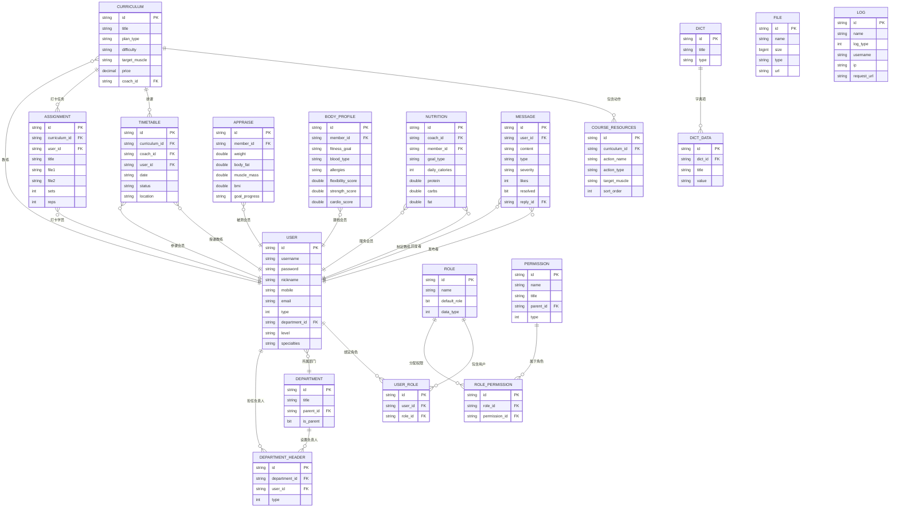

```mermaid
erDiagram
    USER ||--o{ USER_ROLE : "绑定角色"
    ROLE ||--o{ USER_ROLE : "包含用户"
    ROLE ||--o{ ROLE_PERMISSION : "分配权限"
    PERMISSION ||--o{ ROLE_PERMISSION : "属于角色"
    USER }o--|| DEPARTMENT : "所属部门"
    DEPARTMENT ||--o{ DEPARTMENT_HEADER : "设置负责人"
    USER ||--o{ DEPARTMENT_HEADER : "担任负责人"
    CURRICULUM ||--o{ COURSE_RESOURCES : "包含动作"
    CURRICULUM ||--o{ TIMETABLE : "排课"
    CURRICULUM ||--o{ ASSIGNMENT : "打卡任务"
    CURRICULUM }o--|| USER : "教练"
    TIMETABLE }o--|| USER : "授课教练"
    TIMETABLE }o--|| USER : "参课会员"
    ASSIGNMENT }o--|| USER : "打卡学员"
    APPRAISE }o--|| USER : "被测会员"
    BODY_PROFILE }o--|| USER : "建档会员"
    NUTRITION }o--|| USER : "制定教练"
    NUTRITION }o--|| USER : "服务会员"
    MESSAGE }o--|| USER : "发布者"
    MESSAGE }o--|| USER : "回复者"
    DICT ||--o{ DICT_DATA : "字典项"
    USER {
        string id PK
        string username
        string password
        string nickname
        string mobile
        string email
        int type
        string department_id FK
        string level
        string specialties
    }
    ROLE {
        string id PK
        string name
        bit default_role
        int data_type
    }
    PERMISSION {
        string id PK
        string name
        string title
        string parent_id FK
        int type
    }
    USER_ROLE {
        string id PK
        string user_id FK
        string role_id FK
    }
    ROLE_PERMISSION {
        string id PK
        string role_id FK
        string permission_id FK
    }
    DEPARTMENT {
        string id PK
        string title
        string parent_id FK
        bit is_parent
    }
    DEPARTMENT_HEADER {
        string id PK
        string department_id FK
        string user_id FK
        int type
    }
    CURRICULUM {
        string id PK
        string title
        string plan_type
        string difficulty
        string target_muscle
        decimal price
        string coach_id FK
    }
    COURSE_RESOURCES {
        string id PK
        string curriculum_id FK
        string action_name
        string action_type
        string target_muscle
        int sort_order
    }
    TIMETABLE {
        string id PK
        string curriculum_id FK
        string coach_id FK
        string user_id FK
        string date
        string status
        string location
    }
    ASSIGNMENT {
        string id PK
        string curriculum_id FK
        string user_id FK
        string title
        string file1
        string file2
        int sets
        int reps
    }
    APPRAISE {
        string id PK
        string member_id FK
        double weight
        double body_fat
        double muscle_mass
        double bmi
        string goal_progress
    }
    BODY_PROFILE {
        string id PK
        string member_id FK
        string fitness_goal
        string blood_type
        string allergies
        double flexibility_score
        double strength_score
        double cardio_score
    }
    NUTRITION {
        string id PK
        string coach_id FK
        string member_id FK
        string goal_type
        int daily_calories
        double protein
        double carbs
        double fat
    }
    MESSAGE {
        string id PK
        string user_id FK
        string content
        string type
        string severity
        int likes
        bit resolved
        string reply_id FK
    }
    DICT {
        string id PK
        string title
        string type
    }
    DICT_DATA {
        string id PK
        string dict_id FK
        string title
        string value
    }
    FILE {
        string id PK
        string name
        bigint size
        string type
        string url
    }
    LOG {
        string id PK
        string name
        int log_type
        string username
        string ip
        string request_url
    }

```